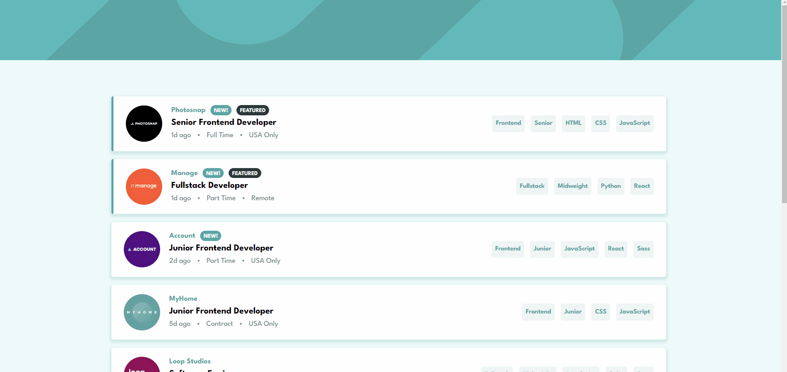

<h1 align="center">
  <span>Job listings with filtering</span>
</h1>

<p align="center">
  <a href="#-projeto">Projeto</a>&nbsp;&nbsp;&nbsp;|&nbsp;&nbsp;&nbsp;
  <a href="#-tecnologias">Tecnologias</a>&nbsp;&nbsp;&nbsp;|&nbsp;&nbsp;&nbsp;
  <a href="#-instalação">Instalação</a>&nbsp;&nbsp;&nbsp;|&nbsp;&nbsp;&nbsp;
  <a href="#memo-licença">Licença</a>
</p>

<br>

<p align="center">
  
</p>

<br>

## 💻 Projeto

Your challenge is to build out this job listing page and get it looking as close to the design as possible [Frontend Mentor](https://www.frontendmentor.io/challenges/job-listings-with-filtering-ivstIPCt).

You can use any tools you like to help you complete the challenge. So if you've got something you'd like to practice, feel free to give it a go.

Your users should be able to:

-   View the optimal layout for the site depending on their device's screen size
-   See hover states for all interactive elements on the page
-   Filter job listings based on the categories

### Filtering

#### Option 1

Filter job listings based on the categories using the HTML `data-` attribute. In this option, you'd use the hardcoded content that already exists in the [index.html](./index.html) file.

The categories are:

-   Role: Frontend, Backend, Fullstack
-   Level: Junior, Midweight, Senior
-   Languages: Python, Ruby, JavaScript, HTML, CSS
-   Tools: React, Sass, Vue, Django, RoR (Ruby on Rails)

So, if a job listing is for has the following categories `Frontend, Junior, JavaScript, React` your HTML data attributes would look like this `data-role="frontend" data-level="junior" data-languages="javascript" data-tools="react"`.

#### Option 2

Use the [data.json](./data.json) file to pull the data and then dynamically add the content. This would be perfect if you're looking to practice a JS library/framework like React, Vue, or Svelte.

To add a filter, the user needs to click on the tablets on the right-side of the listing on desktop or the bottom on mobile. For each filter added, only listings containing all selected filters should be returned.

Want some support on the challenge? [Join our Slack community](https://www.frontendmentor.io/slack) and ask questions in the **#help** channel.

## 🚀 Tecnologias

Esse projeto foi desenvolvido com as seguintes tecnologias:

-   [TypeScript](https://www.typescriptlang.org/)
-   [React](https://pt-br.reactjs.org/)
-   [Styled Components](https://styled-components.com/)
-   [Vite](https://vitejs.dev/)
-   [Vercel](https://vercel.com/)

## 📥 Instalação

Faça um clone desse repositório e acesse o diretório. Em instale todas as dependências com o seguinte comando:

```bash
npm i
```

Em seguida execute o comando

```bash
npm run dev
```

## :memo: Licença

Esse projeto está sob a licença MIT. Veja o arquivo [LICENSE](LICENSE.md) para mais detalhes.

---

**Desenvolvido por [Bruno César](https://github.com/brunocs90).**
